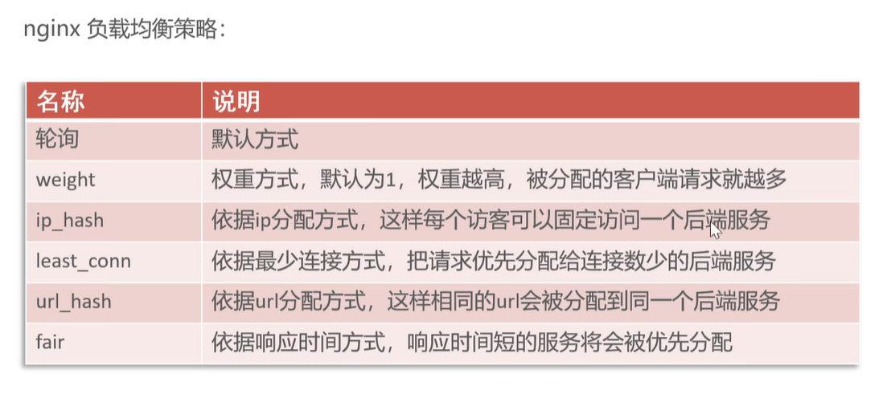
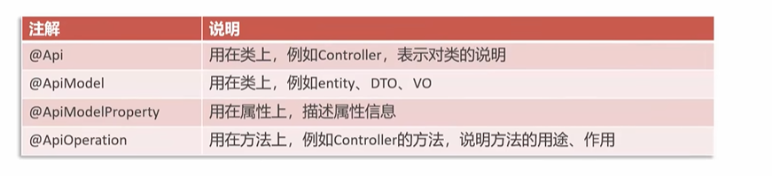

## Day 01

1. 搭建了数据库环境

2. 测试前后端连调

3. **Nginx反向代理**
   即将前端发送的动态请求有Nginx转发到后端
   3.1 Nginx的好处

   - 提高访问速度
   - 进行负载均衡
   - 保证后端服务安全

   3.2 Nginx反向代理的配置方法

   ```xml
   server {
       listen       80;
       server_name  localhost;
       location /api/ {
           proxy_pass   http://localhost:8080/admin/;
       }
   }
   ```

   3.3 Nginx负载均衡的配置方式

   ```xml
   upstream webservers{
     server 127.0.0.1:8080 weight=90 ;
     server 127.0.0.1:8088 weight=10 ;
   }
   server {
       listen       80;
       server_name  localhost;
       location /api/ {
           proxy_pass   http://webservers/admin/; #负载均衡
       }
   }
   ```

   3.4 Nginx负载均衡的策略

   


4. 导入接口文档
   前后端定制接口并开发自测接口

5. 用Swagger生产接口文档并进行后端的接口测试
   5.1 使用Knife4j框架
   Knife4j是为Java MVC框架集成Swagger生产Api文档的增强解决方案
   导入依赖

   ```xml
   <dependency>
       <groupId>com.github.xiaoymin</groupId>
       <artifactId>knife4j-spring-boot-starter</artifactId>
       <version>3.0.2</version>
   </dependency>
   ```

   5.2 在配置类中加入knife4j相关配置

   ```java
   @Bean
   public Docket docket() {
       log.info("准备生成接口文档...");
       ApiInfo apiInfo = new ApiInfoBuilder()
               .title("苍穹外卖项目接口文档")
               .version("2.0")
               .description("苍穹外卖项目接口文档")
               .build();
       Docket docket = new Docket(DocumentationType.SWAGGER_2)
               .apiInfo(apiInfo)
               .select()
           	//指定生成接口扫描的包
               .apis(RequestHandlerSelectors.basePackage("com.sky.controller"))
               .paths(PathSelectors.any())
               .build();
       return docket;
   }
   ```

   5.3 设置静态资源映射

   ```java
   protected void addResourceHandlers(ResourceHandlerRegistry registry) {
       log.info("开始设置静态资源输出...");
       registry.addResourceHandler("/doc.html").addResourceLocations("classpath:/META-INF/resources/");
       registry.addResourceHandler("/webjars/**").addResourceLocations("classpath:/META-INF/resources/webjars/");
   }
   ```

   5.4 打开localhost:8080/doc.html 链接
   5.5 Swagger常用注解
   通过注解可以生成的接口文档，使接口文档具有更好的可读性，常用的注解如下：

   

​	
